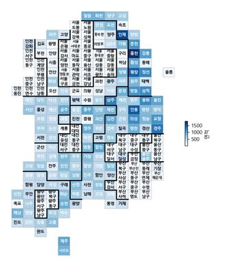
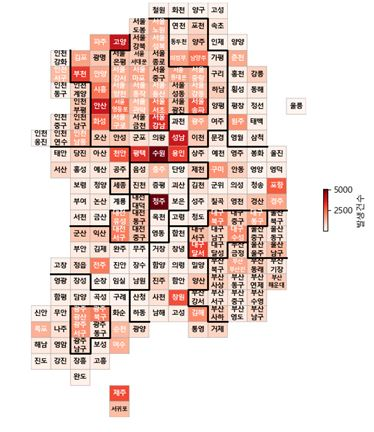
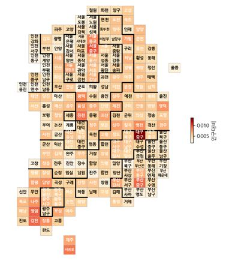

# 본인의 과제명 작성

학과 | 학번 | 성명
---- | ---- | ---- 
정보컴퓨터공학과 | 201624510 | 안소연

## 프로젝트 개요
 전국 각 시군구별 교통사고 데이터를 받아 이를 matplotlib를 사용하여 분석

## 사용한 공공데이터 
1. [데이터보기](https://github.com/ssy58/python_final_term/blob/master/data.csv)  
[도로교통공단교통사고통계](https://www.data.go.kr/dataset/3038489/fileData.do)
2. [데이터보기](https://github.com/ssy58/python_final_term/blob/master/data_draw_korea.csv)

## 프로그램 다이어그램 

## 프로그램 시연 동영상
[동영상 보기 ](https://youtu.be/C-IWiDyprUQ)

## 프로그램 실행 결과
1. matplotlib 사용 우리나라 지도 생성 

2. 교통사고 발생 건수별 지도 생성 

3. 인구대비 교통사고 지도 생성 

## 소스
* [링크로 소스 내용 보기](https://github.com/ssy58/python_final_term/blob/master/main.py) 

* 코드 삽입

<pre><code>

import pandas as pd
import numpy as np
import matplotlib.pyplot as plt
from matplotlib import font_manager, rc

def getData():
    df =pd.read_csv('data.csv', encoding='euc-kr')
    df = df[['시도','시군구','발생건수']]
    df = df.groupby(['시도','시군구'],as_index=False).sum()
    return df

def setData(df1,df2):
    df1['발생건수']= np.NaN
    sagoArr = []
    for row1 in range(0,len(df1)):
        for row2  in range(0,len(df2)):
            if df1['광역시도'][row1] == df2['시도'][row2] and df1['행정구역'][row1] == df2['시군구'][row2]:
                sagoArr.append(df2['발생건수'][row2])

    df1['발생건수'] = sagoArr
    return df1

def drawKorea(targetData, blockedMap, d1, d2, cmapname):
    gamma = 0.75

    whitelabelmin = (max(blockedMap[targetData]) - min(blockedMap[targetData])) * 0.25 + min(blockedMap[targetData])

    datalabel = targetData

    vmin = min(blockedMap[targetData])
    vmax = max(blockedMap[targetData])

    BORDER_LINES = [
        [(3, 2), (5, 2), (5, 3), (9, 3), (9, 1)],  # ��õ
        [(2, 5), (3, 5), (3, 4), (8, 4), (8, 7), (7, 7), (7, 9), (4, 9), (4, 7), (1, 7)],  # ����
        [(1, 6), (1, 9), (3, 9), (3, 10), (8, 10), (8, 9),
         (9, 9), (9, 8), (10, 8), (10, 5), (9, 5), (9, 3)],  # ��⵵
        [(9, 12), (9, 10), (8, 10)],  # ������
        [(10, 5), (11, 5), (11, 4), (12, 4), (12, 5), (13, 5),
         (13, 4), (14, 4), (14, 2)],  # ��û����
        [(11, 5), (12, 5), (12, 6), (15, 6), (15, 7), (13, 7),
         (13, 8), (11, 8), (11, 9), (10, 9), (10, 8)],  # ��û�ϵ�
        [(14, 4), (15, 4), (15, 6)],  # ������
        [(14, 7), (14, 9), (13, 9), (13, 11), (13, 13)],  # ���ϵ�
        [(14, 8), (16, 8), (16, 10), (15, 10),
         (15, 11), (14, 11), (14, 12), (13, 12)],  # �뱸��
        [(15, 11), (16, 11), (16, 13)],  # ����
        [(17, 1), (17, 3), (18, 3), (18, 6), (15, 6)],  # ����ϵ�
        [(19, 2), (19, 4), (21, 4), (21, 3), (22, 3), (22, 2), (19, 2)],  # ���ֽ�
        [(18, 5), (20, 5), (20, 6)],  # ���󳲵�
        [(16, 9), (18, 9), (18, 8), (19, 8), (19, 9), (20, 9), (20, 10)],  # ��
    ]

    mapdata = blockedMap.pivot(index='y', columns='x', values=targetData)
    masked_mapdata = np.ma.masked_where(np.isnan(mapdata), mapdata)

    plt.figure(figsize=(8, 13))
    plt.pcolor(masked_mapdata, vmin=vmin, vmax=vmax, cmap=cmapname, edgecolor='#aaaaaa', linewidth=0.5)

    for idx, row in blockedMap.iterrows():
        annocolor = 'white' if row[targetData] > whitelabelmin else 'black'

        # 광역시는 구 이름이 겹치는 경우가 많아서 시단위 이름도 같이 표시한다. (중구, 서구)
        if row[d1].endswith('시') and not row[d1].startswith('세종'):
            dispname = '{}\n{}'.format(row[d1][:2], row[d2][:-1])
            if len(row[d2]) <= 2:
                dispname += row[d2][-1]
        else:
            dispname = row[d2][:-1]

        # 서대문구, 서귀포시 같이 이름이 3자 이상인 경우에 작은 글자로 표시한다.
        if len(dispname.splitlines()[-1]) >= 3:
            fontsize, linespacing = 6.5, 1.5
        else:
            fontsize, linespacing = 8, 1.2

        plt.annotate(dispname, (row['x'] + 0.5, row['y'] + 0.5), weight='bold',
                     fontsize=fontsize, ha='center', va='center', color=annocolor,
                     linespacing=linespacing)

        # 시도 경계 그린다.
    for path in BORDER_LINES:
        ys, xs = zip(*path)
        plt.plot(xs, ys, c='black', lw=2)

    plt.gca().invert_yaxis()
    # plt.gca().set_aspect(1)

    plt.axis('off')

    cb = plt.colorbar(shrink=.1, aspect=10)
    cb.set_label(datalabel)

    fig = plt.gcf()
    fig.set_size_inches(6,8)

    plt.tight_layout()
    plt.show()

font_name = font_manager.FontProperties(fname="c:/Windows/Fonts/malgun.ttf").get_name()
rc('font', family=font_name)

data_korea = pd.read_csv('data_draw_korea.csv', index_col=0,encoding='euc-kr')
data_korea.head()

df = getData()
df2 = setData(data_korea,df)
df2['인구대비'] = df2['발생건수']/df2['인구수']
df2.to_csv("newData.csv")

drawKorea('발생건수', df2, '광역시도', '행정구역','Reds')
drawKorea('인구대비', df2, '광역시도', '행정구역','OrRd')

</code></pre>
